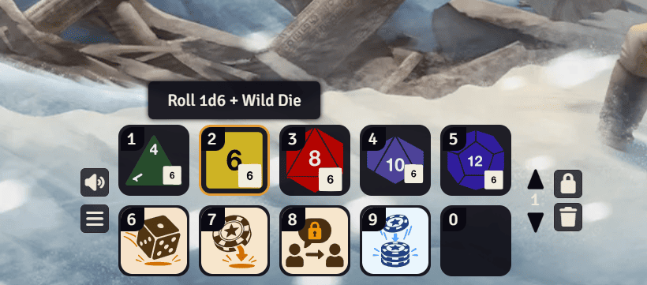
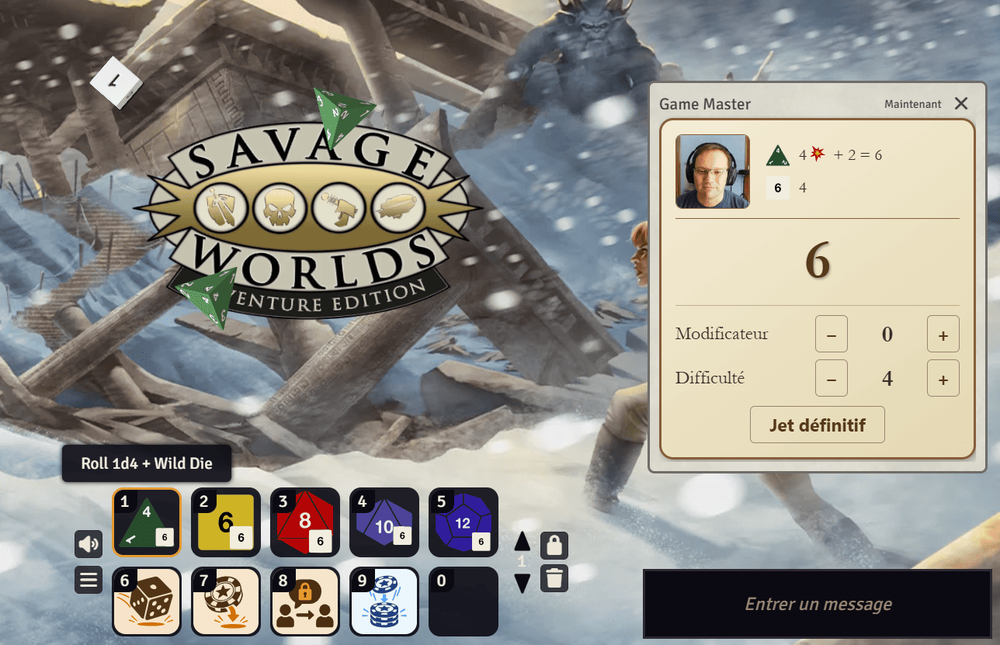
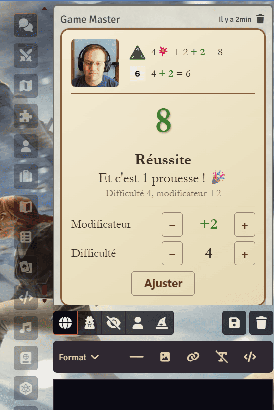
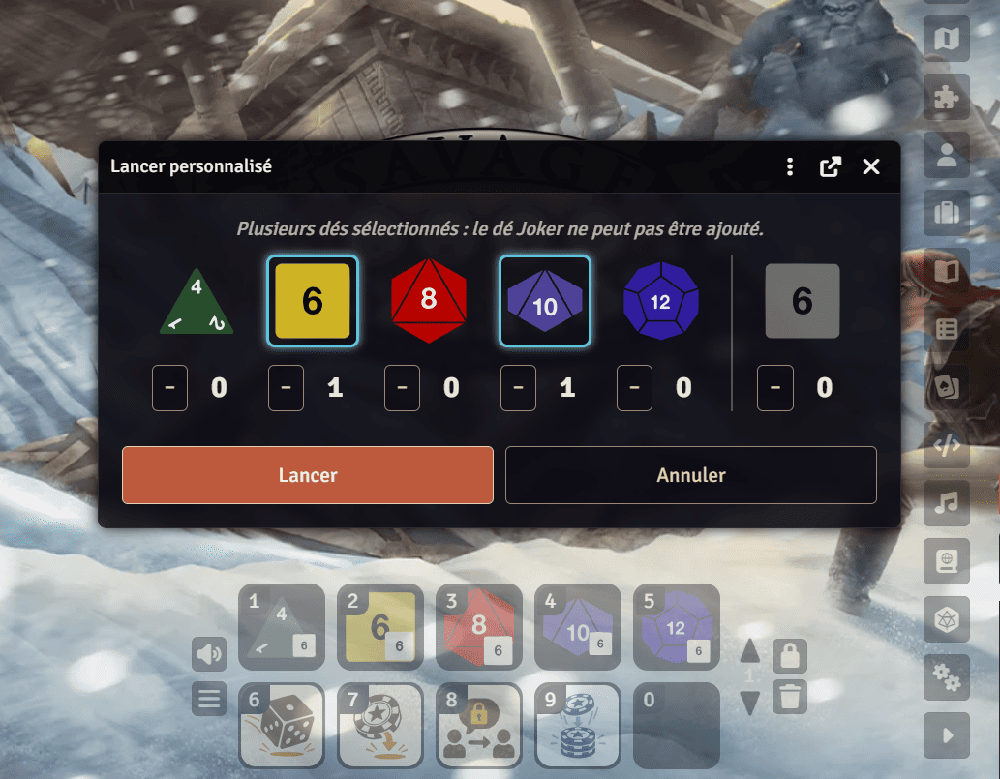
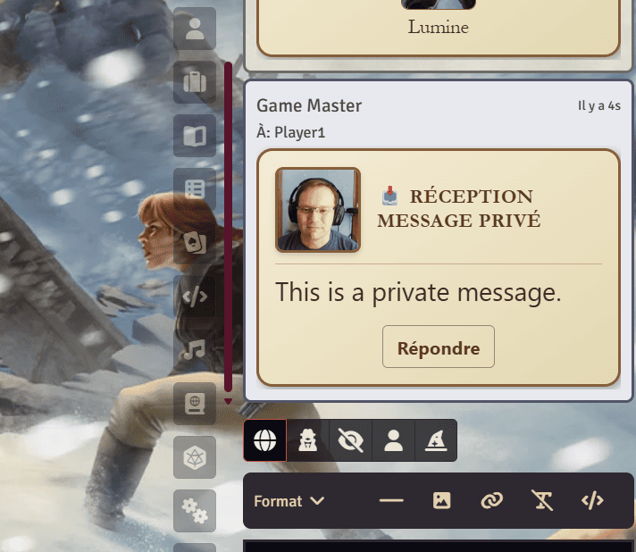
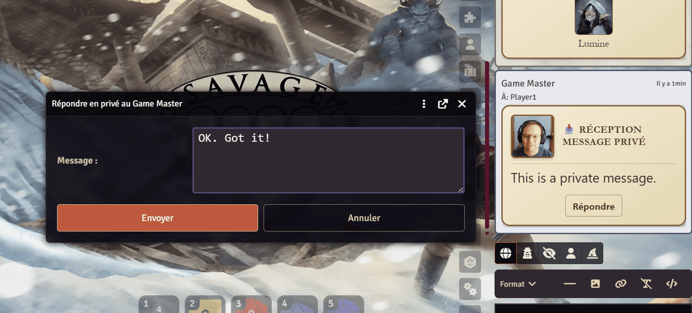
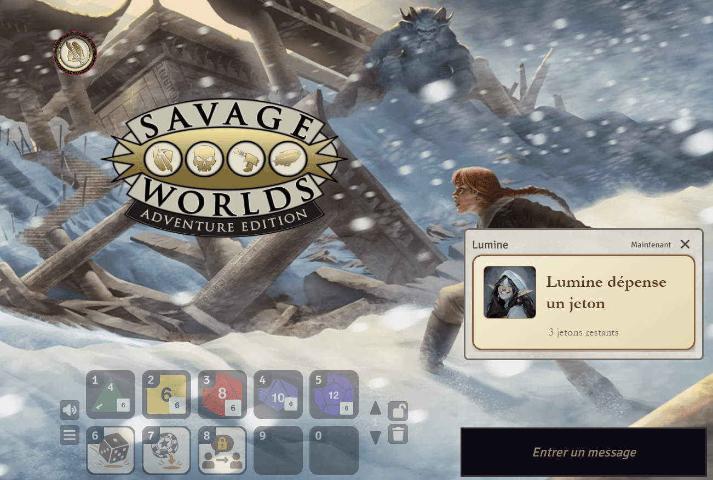
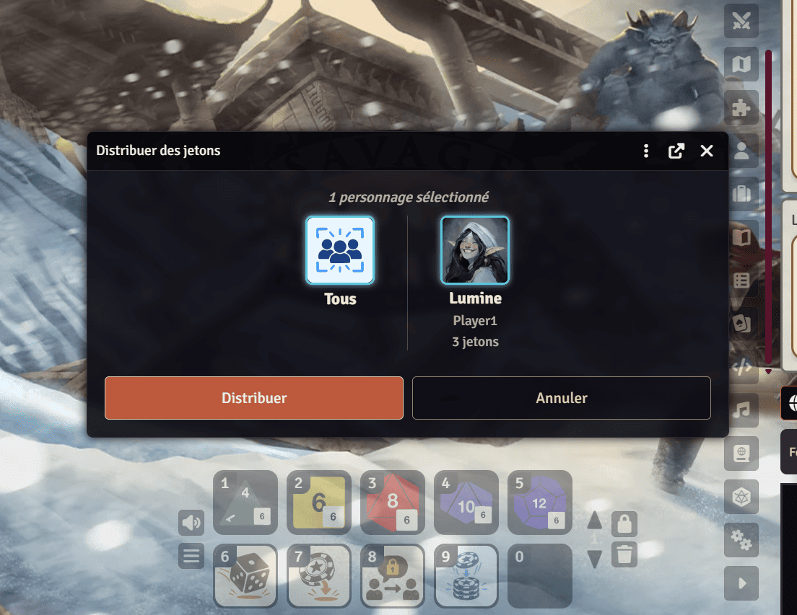

# Macros Savage Worlds pour Foundry VTT

*[English version](README.md)*

Un ensemble de macros pour jouer à **Savage Worlds (SWADE)** sur **Foundry VTT** : jets de trait, palette
de dés, messages privés entre joueurs et jetons. Les jets et les jetons s'affichent sous forme de cartes
« parchemin » dans le tchat, dans la langue de chaque joueur (français ou anglais).

Les macros sont développées avec Foundry v14, sur The Forge, avec le
[système SWADE](https://gitlab.com/peginc/swade).

## Intention

Ces macros limitent volontairement **l'assistance et l'automatisation**. Automatiser n'a rien de
répréhensible, mais j'ai remarqué que mes joueurs étaient moins créatifs avec les règles, et finissaient
par les méconnaître, parce qu'ils étaient devenus passifs.

Les macros visent à reproduire ce qui se passe autour d'une vraie table : lancer les dés, calculer les
modificateurs à la main, recevoir et dépenser des jetons, s'échanger des messages privés. Le reste de notre
façon de jouer sur Foundry va dans le même sens :

- **L'initiative** est gérée par le système (tirage des cartes).
- Nous nous contentons de **déplacer des tokens** : nous ne choisissons pas de cible, et nous ne laissons pas
  le système déterminer si une attaque réussit, tirer les dégâts ni les appliquer.
- Nous utilisons la fonction native de Foundry, le **ping**, pour désigner un endroit à l'écran.
- Nous utilisons **SimpleFog** à la place du brouillard de guerre et de la gestion de la visibilité de
  Foundry.

Si tu cherches l'inverse, une table où le système fait les comptes à ta place, ces macros ne sont
probablement pas ce qu'il te faut.

## Ce qu'il faut

| | |
|---|---|
| Foundry VTT | v13 ou v14 |
| Système | Savage Worlds Adventure Edition (SWADE) |
| [Macro Runner](https://foundryvtt.com/packages/macro-runner) | Lance `start-session` au démarrage du monde (voir [Installation](#installation)) |
| [Dice So Nice](https://foundryvtt.com/packages/dice-so-nice) | Facultatif : dés en 3D, effet spécial sur un double 1, animation du jeton |

## Installation

1. Dans Foundry, en tant que meneur de jeu, crée une macro de type **script** et colle-y le contenu de
   [`install-macros.js`](install-macros.js). Exécute-la.
2. Rafraîchis la page (F5).
3. Configure **Macro Runner** pour qu'il lance la macro `start-session` au démarrage (réglages de Macro
   Runner, *Global Startup Macros*). Le nom doit être exactement `start-session`.

L'installeur crée les macros, leur donne leurs icônes et les place dans la barre de raccourcis de **tous**
les utilisateurs du monde, connectés ou non :

| Emplacement | Macro | Pour |
|:---:|---|---|
| 1 à 5 | Lancer 1d4, 1d6, 1d8, 1d10, 1d12 + Joker | Tout le monde |
| 6 | Lancer personnalisé (palette de dés) | Tout le monde |
| 7 | Dépenser un jeton | Tout le monde |
| 8 | Message privé | Tout le monde |
| 9 | Distribuer des jetons | Meneur de jeu seulement |
| | `start-session` (sans emplacement) | Lancée au démarrage |

<p align="center"></p>

Tu peux relancer `install-macros.js` à tout moment pour mettre les macros à jour : il ne renomme jamais une
macro que tu as renommée. Pour tout retirer, exécute [`uninstall-macros.js`](uninstall-macros.js).
Rafraîchis la page (F5) après chaque installation.

> **Astuce.** Le système SWADE poste son propre message dans le tchat quand un jeton est dépensé ou donné.
> Pour éviter un doublon avec les cartes ci-dessous, désactive le réglage de monde SWADE qui notifie les
> jetons dans le tchat (`notifyBennies`).

## Les macros

> Les captures d'écran montrent l'interface en français ; les cartes et les fenêtres suivent la langue de chaque joueur.

### Jets de trait (d4 à d12)

Un clic lance un **dé de trait** et le **dé Joker** (un d6), tous deux explosifs, et garde le meilleur. Le
résultat est une carte de tchat avec une ligne par dé (un dé qui explose s'affiche `8💥 + 3 = 11`).

<p align="center"></p>

Sous le total, la personne qui a lancé (et le MJ) peut régler un **Modificateur** (−6 à +6) et une
**Difficulté** (4 par défaut) avec les boutons − et +, puis cliquer sur **Jet définitif**. La carte montre
alors les dés modifiés, **Réussite** ou **Échec** (en vert ou en rouge), et une **prouesse** par tranche
complète de 4 points au-dessus de la difficulté. Le bouton devient **Ajuster**, pour modifier de nouveau
les valeurs.

<p align="center"></p>

- Un dé ne descend jamais sous 1, quel que soit le modificateur (`5 − 6 → 1`).
- **Double 1** : si les deux dés montrent 1, le total est remplacé par un 💀 (échec critique). La carte ne
  peut pas être ajustée, et Dice So Nice joue son effet *Obscurité* sur les dés.

### Lancer personnalisé (palette de dés)

Une fenêtre pour composer n'importe quel jet : choisis combien de dés de chaque taille (d4, d6, d8, d10,
d12), et éventuellement le **dé Joker**.

- Chaque dé est lancé séparément, avec sa propre ligne et ses propres explosions.
- Le dé Joker ne peut être ajouté que s'il y a **un seul** dé (cela fait un jet de trait, avec la carte
  ci-dessus). Avec plusieurs dés, ou le dé Joker seul, le jet est un **jet libre** : les dés sont
  additionnés, le modificateur est ajouté une seule fois, et la difficulté est 0 par défaut (aucun
  résultat affiché tant que tu n'en fixes pas une).

<p align="center"></p>

### Message privé

Envoie un message privé à un autre joueur connecté (ou au MJ). Il arrive sous forme de carte avec un bouton
**Répondre**. Le curseur va directement dans le champ de texte, pour écrire comme pour répondre. Le
destinataire, et lui seul, entend un court son.

<p align="center"> </p>

### Dépenser un jeton

Un clic dépense un jeton de ton personnage assigné (le MJ dépense ses propres jetons) avec le système SWADE :
le compte des jetons, l'animation Dice So Nice et les règles SWADE sont gérés par le système. Une carte
indique à tout le monde qui en a dépensé un et **combien de jetons il reste**, en gras quand il en reste un
et en rouge quand il n'en reste plus.

<p align="center"></p>

Si tu es **propriétaire de plusieurs personnages**, une petite fenêtre te demande lequel dépense le jeton
(un personnage sans jeton est grisé ; ton personnage assigné est choisi par défaut).

### Distribuer des jetons (meneur de jeu seulement)

Une fenêtre avec les avatars des personnages des **joueurs connectés**. Clique les personnages qui reçoivent
un jeton, clique le nom d'un joueur pour choisir tous ses personnages, ou clique **Tous**, puis
**Distribuer**. Chaque personnage choisi reçoit un jeton, et une carte de tchat indique qui en a reçu un.

<p align="center"></p>

Les personnages proposés sont ceux dont un joueur connecté est **propriétaire** (un joueur peut en posséder
plusieurs). Donne aux joueurs la permission *Propriétaire* sur leurs personnages dans Foundry.

### `start-session`

Lancée au démarrage du monde. Elle dessine les cartes du tchat, branche le bouton **Répondre**, enregistre
les couleurs Dice So Nice des dés et joue les sons.

## Sons (expérimental)

Deux courts sons sont installés avec les macros, dans `worlds/<ton monde>/macro-sounds/` :

- une **pièce** quand un personnage gagne un jeton, entendue par tout le monde ;
- un **chuchotement** quand un message privé arrive, entendu par son destinataire seulement.

Chaque son a une constante pour l'activer ou le couper, en tête de son bloc dans
[`start-session.js`](start-session.js) (`LUCKY_COIN_SOUND`, `PRIVATE_MESSAGE_SOUND`).

## Dice So Nice

Les macros gèrent deux choses : les couleurs de chaque taille de dé, et l'effet *Obscurité* sur un double 1.

## Langues

Les cartes et les fenêtres utilisent la langue du Foundry de chaque joueur : anglais (par défaut) ou
français. Les noms des macros (les infobulles de la barre de raccourcis) sont fixés à leur création, dans la
langue du MJ qui les installe. Pour ajouter une langue, voir [`lang/README.md`](lang/README.md).

## Crédits

Ces macros ont été écrites avec l'aide de [Claude Code](https://claude.com/claude-code), l'assistant de
programmation d'Anthropic, et testées par l'auteur dans Foundry.

## Pour les développeurs

Comment tout cela fonctionne, et les choix qui le sous-tendent : voir le **[guide du développeur](docs/DEVELOPERS.fr.md)**.

`install-macros.js` et `uninstall-macros.js` sont **générés** : ne les modifie pas à la main.

| Dossier ou fichier | Rôle |
|---|---|
| `trait-roll-d*.js`, `custom-roll.js`, `private-message.js`, `spend-benny.js`, `give-bennies-to-players.js`, `start-session.js` | Les sources des macros |
| `build/build.py` | Le build : la table des macros (emplacement, icône, MJ seulement), l'installeur et le désinstalleur |
| `lang/` | Les traductions, un fichier JSON par langue |
| `icons/`, `sounds/` | Les icônes (SVG) et les sons, embarqués dans l'installeur |

Après toute modification, lance :

```bash
python build/build.py
```

puis relance `install-macros.js` dans Foundry et rafraîchis la page. `python build/build.py --check`
vérifie que les fichiers générés et les icônes embarquées sont à jour. `python build/build.py --dump <dossier>`
écrit les macros compilées, utile pour les tester hors de Foundry.
